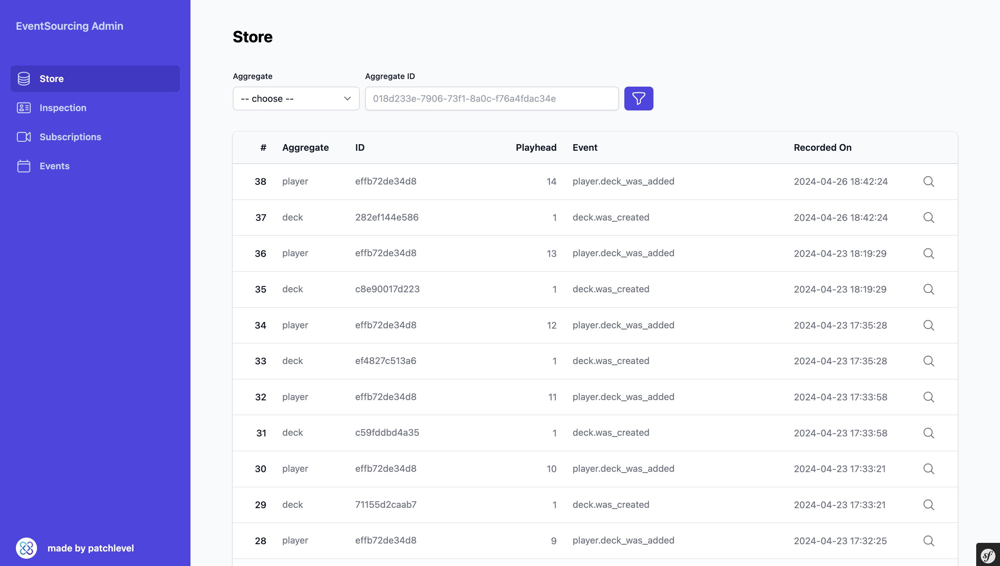
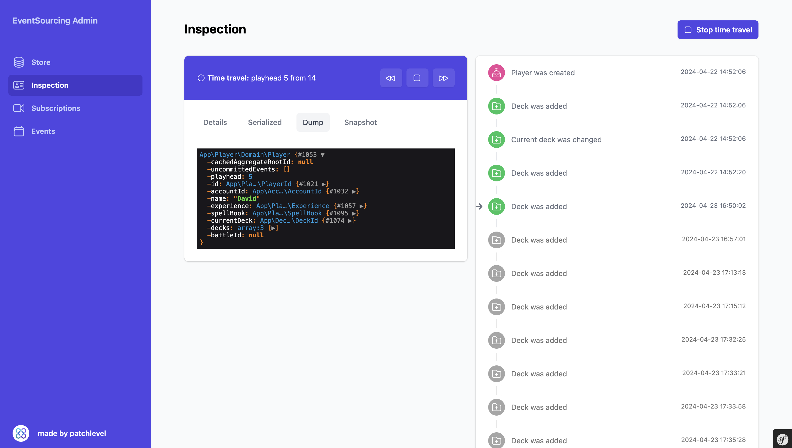
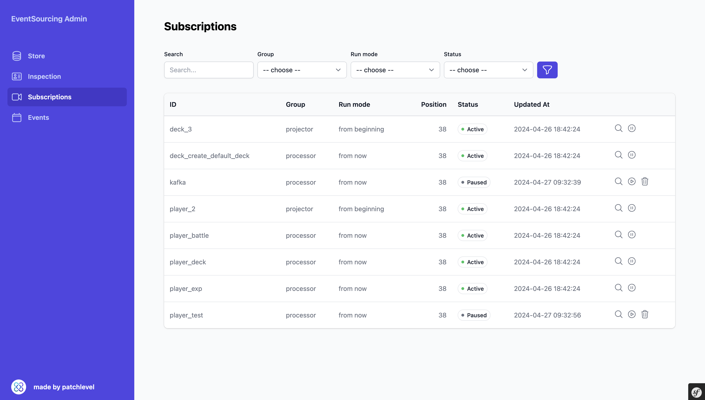
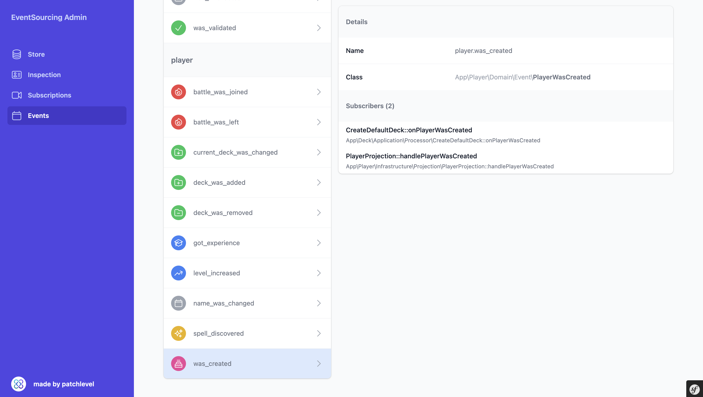

# Event-Sourcing-Admin-Bundle

This bundle provides a dashboard for
the [patchlevel/event-sourcing](https://github.com/patchlevel/event-sourcing) library. This needs
the [patchlevel/event-sourcing-bundle](https://github.com/patchlevel/event-sourcing-bundle) to work properly.

This bundle was initially designed as an DX tool for development but it can also be run on production. If you want to
run it in production be sure to place it behind a login / security measure. Otherwise you will risk that somebody would
mess with your subscriptions, gather internal information about your system and users.

Features:

* Store view
    * Filter by Aggregates
    * Filter by ID's
    * Jump into inspection from there
* Inspection
    * View aggregate details by ID
    * See all events which are recorded
    * See the current serialized state, if configured properly
    * See the current snapshot, if configured properly
    * See the current state via as a dump via `symfony/var-dumper`
    * Time travel to see the state of the aggregate at different point of times
* Events
    * See all registered events
    * See all registered subscriber for these events
* Subscriptions
    * See all registered subscribtions and their current state
    * Filter by Group
    * Filter by RunMode
    * Filter by Status
    * Filter by search
    * Some simple subscription controls like: play, pause or delete subscription

## Screenshots

### Store



### Inspector



### Projection



### Events



## Installation

```bash
composer require --dev patchlevel/event-sourcing-bundle
```

## Configuration

```yaml
# config/packages/patchlevel_event_sourcing_admin.yaml
when@dev:
  patchlevel_event_sourcing_admin:
    enabled: true
```

## Routes

```yaml
# config/routes/patchlevel_event_sourcing_admin.yaml
when@dev:
  event_sourcing:
    resource: '@PatchlevelEventSourcingAdminBundle/config/routes.yaml'
    prefix: /es-admin
```

## Production usage

If you run this on production you would need to install this package as a normal dependency and adjust the configuration
accordingly. Also be sure to place it behind a login / security measure.